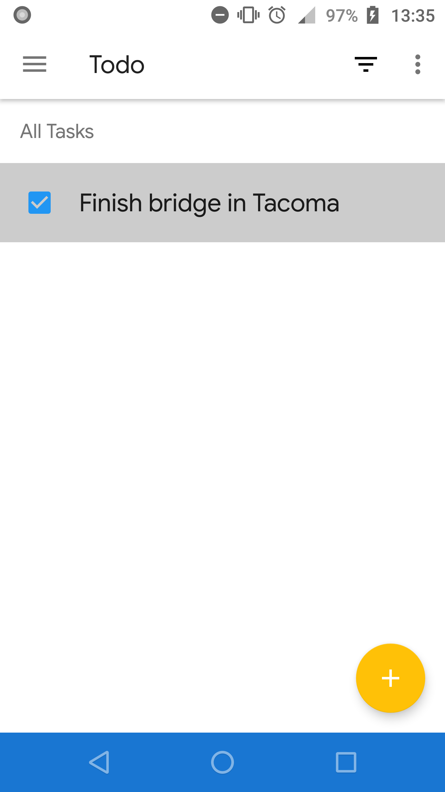
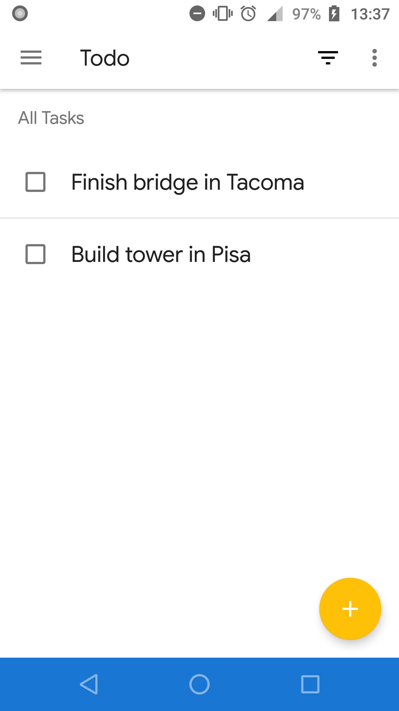
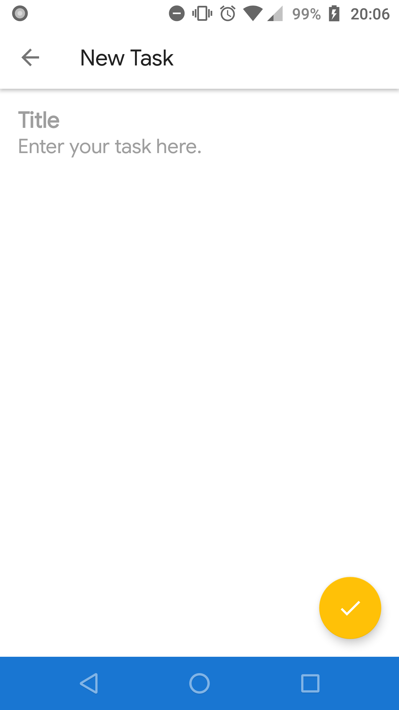
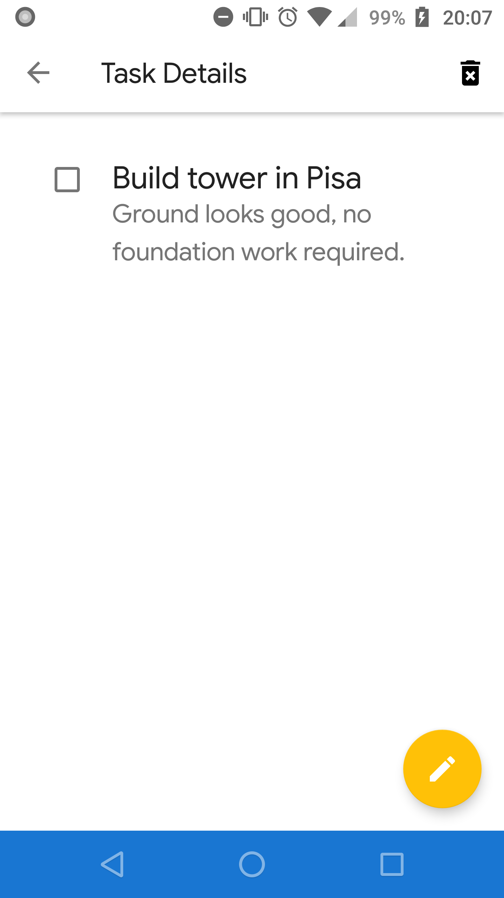

 
 

# TODO Clean MVI App

`TODO MVI Sample App` is a work-in-progress based on [Android Architecture Blueprints - Google Codelabs 2019](https://github.com/googlecodelabs/android-testing) project. 

The main purpose of this project is to master the newest Android application architecture approaches, testing practices like `sharedTest` and - of course - [Kotlin's Coroutines](https://github.com/Kotlin/kotlinx.coroutines). It is still in its really __EARLY stages of development__  and many things to go.

## Languages, libraries and tools used

* [Kotlin](https://kotlinlang.org/)
* [Kotlin's Coroutines](https://github.com/Kotlin/kotlinx.coroutines)
* [Constraint Layout 2](https://androidstudio.googleblog.com/2018/08/constraintlayout-200-alpha-2.html)
* [Android's DataBinding Library](https://developer.android.com/topic/libraries/data-binding)
* [Android Architecture Components](https://developer.android.com/topic/libraries/architecture/index.html)
* [AndroidX Support Libraries](https://developer.android.com/jetpack/androidx)
* [Material Components for Android](https://github.com/material-components/material-components-android)
* [Retrofit](http://square.github.io/retrofit/)
* [OkHttp](http://square.github.io/okhttp/)
* [Gson](https://github.com/google/gson)
* [Timber](https://github.com/JakeWharton/timber)
* [Mockito](http://site.mockito.org/)
* [Truth](https://github.com/google/truth)
* [Espresso](https://developer.android.com/training/testing/espresso/index.html)
* [Robolectric](http://robolectric.org/)

## Requirements

* JDK 1.8
* [Android SDK](https://developer.android.com/studio/index.html)
* Android O ([API 26](https://developer.android.com/preview/api-overview.html))
* Latest Android SDK Tools and build tools.

## Architecture

The architecture of this project follows the principles of Clean Architecture and it looks like this:

The sample app when run will show you (depends on `mock`/`prod` flavour) a list of all the `Task`s or an empty view.

Let's take a look at each of the `Todo` application's architecture layers and check a role each one plays in this project.

_TODO_

## What I've learned so far thanks to this project:
- dealing with `Kotlin's Coroutines` in daily Android development process
- creating a single-activity Android application thanks to [`Android Jetpack's Navigation`](https://developer.android.com/guide/navigation/navigation-migrate) library
- using `DataBinding` features including `BindingAdapter`s to simplify injecting model into view (goodbye `kotlin-android-extensions`)
- sharing code between `test` and `androidTest` packages, create mixed test cased (in one word: `sharedTest`)
- refactoring legacy code to clean architecture approach without creating additional modules (good approach for only _mobile_ app)
- creating my own `EspressoIdlingResource` implementations ([`SimpleCountingIdlingResource`](https://github.com/piotrek1543/todo-mvi-sample-app/blob/master/app/src/main/java/com/piotrek1543/example/todoapp/ui/util/SimpleCountingIdlingResource.kt), [`DataBindingIdlingResource`](https://github.com/piotrek1543/todo-mvi-sample-app/blob/master/app/src/sharedTest/java/com/piotrek1543/example/todoapp/util/DataBindingIdlingResource.kt))
- testing in a isolated way fragments using `FragmentScenario` and activities using `ActivityScenario`
- automating app's versioning usin Git (check [`script-git-version.gradle`](https://github.com/piotrek1543/todo-mvi-sample-app/blob/master/gradle/script-git-version.gradle) for implementation details)

## TODO
- [ ] Describe app's architecture (cache, remote, data, presentation, ui) in `Readme.md`
- [ ] Use `Dagger2` dependency injection framework instead of `ServiceLocator` (more mature solution)
- [ ] Create `TasksDataSourceFactory` to manage `TasksDataStore`s - actually both remote and cached data sources are passed into `TasksRepository` implementations, better solution - check when the data was last saved/cached and depends on it use
a suitable source
- [ ] Fix caching issue in TasksDataRepository (tasks are keep as long as UI is avaiable for the user, killing app `resets` a repository)
- [ ] Implement `Firebase Realtime Database` service to manage `TasksRemoteDataSource`
- [ ] Add `Notification` when action is trigged (like: saving task) for intrumentation test purpose (no case for `UIAutomator2`)
- [ ] Add [`AnyChart`'s pie chart](https://github.com/AnyChart/AnyChart-Android) (do not forget about tests)
- [ ] Flatten fragments layout using `ConstraintLayout` (for now a few views are based on nested `LinearLayout`s)
- [ ] Add instrumentation tests for `TasksFilterType` and mappers cases

## Issues

Feel free to submit issues and enhancement requests.

## Contributing

Please refer to each project's style guidelines and guidelines for submitting patches and additions. In general, we follow the "fork-and-pull" Git workflow.

 1. **Fork** the repo on GitHub
 2. **Clone** the project to your own machine
 3. **Commit** changes to your own branch
 4. **Push** your work back up to your fork
 5. Submit a **Pull request** so that we can review your changes

## License

    Copyright 2019 Piotr Ekert

    Licensed under the Apache License, Version 2.0 (the "License");
    you may not use this file except in compliance with the License.
    You may obtain a copy of the License at

       http://www.apache.org/licenses/LICENSE-2.0

    Unless required by applicable law or agreed to in writing, software
    distributed under the License is distributed on an "AS IS" BASIS,
    WITHOUT WARRANTIES OR CONDITIONS OF ANY KIND, either express or implied.
    See the License for the specific language governing permissions and
    limitations under the License.

## Credits

This project wouldn't be created if some repositories weren't created before

- https://github.com/kanawish/android-mvi-sample

- https://github.com/oldergod/android-architecture

- https://github.com/googlesamples/android-architecture

- https://github.com/bufferapp/android-clean-architecture-mvi-boilerplate